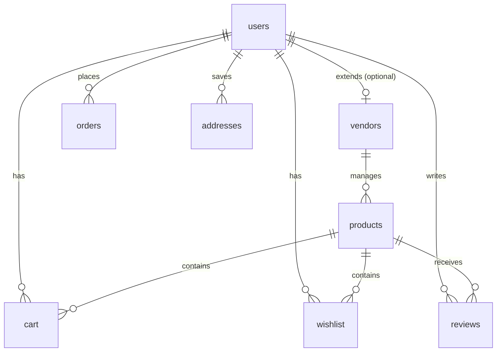

# 🌸 Kushvi Closet

Welcome to **Kushvi Closet** — a premium, production-ready, Pinterest-inspired fashion boutique platform. This application bridges the gap between aesthetic social media boards and designer boutique apparel, featuring cutting-edge visual search, high-fidelity AI virtual try-on, and direct vendor checkout integrations.

---

## ✨ Features

### 1. 🔍 Pinterest Visual Search
Powered by the **Google Cloud Vision API**, users can upload any fashion inspiration photo or input a Pinterest pin URL. The system automatically performs object localization and label detection to extract styles, fabrics, and aesthetics, recommending the closest matching boutique products from our database.

### 2. 👗 AI Virtual Try-On
Powered by **Fashn AI (`tryon-max` model)**, users can upload their own portrait image and choose any garment from the catalog. The system processes the image to output a high-fidelity virtual try-on preview, allowing customers to "wear what they pin" before making a purchase.

### 3. 💳 Razorpay Payments Gateway
A fully integrated, secure payment system using **Razorpay Checkout**. Checkout order generation and server-side HMAC signature verification guarantee transaction integrity before database insertions.

### 4. 🏪 Multi-Vendor System
Separate roles for **Customers, Vendors, and Admins**:
*   **Vendors**: Dedicated interface to manage active catalogs, input pricing/original comparison pricing, size options, custom color hex swatches, and track fulfillment status.
*   **Admins**: Comprehensive control center visualizing store analytics, pending orders, vendor approval toggles, and user directory management.

---

## 🛠️ Tech Stack

*   **Framework**: Next.js 14 (App Router, Tailwind CSS, TypeScript)
*   **Database & Auth**: Supabase (PostgreSQL, Row Level Security, User Triggers)
*   **Payments**: Razorpay Node SDK & Razorpay Web Checkout JS
*   **Generative AI**: Fashn AI REST API
*   **Computer Vision**: Google Cloud Vision API
*   **Animations**: Framer Motion & Canvas Confetti

---

## 🚀 Getting Started

### 1. Clone and Install Dependencies
```bash
git clone git@github.com:kingoficealwaysnice/kushvi-closet.git
cd kushvi-closet
npm install
```

### 2. Configure Environment Variables
Copy the template configuration file:
```bash
cp .env.example .env.local
```
Open `.env.local` and populate it with your Supabase, Google Cloud, Razorpay, and Fashn AI credentials. (Mock configurations are enabled automatically as fallbacks if keys are left blank).

### 3. Initialize the Supabase Database
1. Go to your **Supabase Dashboard** > **SQL Editor**.
2. Copy the contents of [`schema.sql`](file:///Users/air/Downloads/ECOMMERCE/schema.sql) into the query window and execute.
3. This sets up the custom enums, tables, Row Level Security (RLS) policies, and the profile synchronization trigger.

### 4. Run the Development Server
```bash
npm run dev
```
Open [http://localhost:3000](http://localhost:3000) to view your local instance.

---

## 📊 Database Schema Details

The system runs on a highly structured relational database schema:



### Profile Auto-Synchronization Trigger
To keep authentication profile records synced, a PostgreSQL trigger function is set up in `schema.sql`:
*   **Trigger**: `on_auth_user_created`
*   **Function**: `public.handle_new_user()`
*   *Behavior*: Whenever a new user signs up via Supabase Auth, their email, full name, phone number, and avatar URL are automatically populated into the public `users` table with the default role `'customer'`.

### Row Level Security (RLS) Policies
Each table has strict security policies enabled to protect user data:
*   `users`: Users can read/write their own profile; admins have full access.
*   `cart` & `wishlist`: Restricted to the authenticated user owning the records.
*   `products`: Public read access for active items; write actions restricted to the product's owning vendor or admins.
*   `orders`: Users can insert and read their own orders; vendors and admins can view orders related to their products for fulfillment.

---

## 📦 Production Deployment

### Building and Bundling
Ensure the project builds cleanly for production compilation:
```bash
npm run build
```

### Deploying to Vercel
1. Link your repository to Vercel.
2. In the Vercel Project Settings, add all the environment variables listed in `.env.example`.
3. Set the build command to `npm run build` and output directory to `.next`.
4. Deploy!
